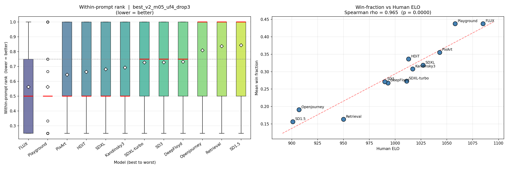

# TaxoGen — ImageReward fine-tuning experiments

Fine-tunes the [ImageReward-v1.0](https://github.com/THUDM/ImageReward) reward model on
pairwise human preferences over 12 image generators, then evaluates whether the resulting
ranking matches human ELO.

## Download images

```bash
hf download Kate-03/TaxoGen_sampled --repo-type=dataset --local-dir data
```

## Setup

Python 3.10 + PyTorch (CUDA 12.8). ImageReward needs small patches to work with
`transformers>=5` (already applied locally; see end of README). Both `transformers==4.30.2`
and `transformers==5.7.0` give numerically identical results.

```bash
python3.10 -m venv benv
source benv/bin/activate
pip install torch torchvision --index-url https://download.pytorch.org/whl/cu128
pip install pandas scikit-learn matplotlib scipy "transformers==4.30.2" image-reward
pip install git+https://github.com/openai/CLIP.git
```

## Training

```bash
bash run_experiments_v2.sh        # margin loss sweep
```

Best config: `--loss margin --margin 0.5 --unfreeze_top_layers 4 --weight_decay 1e-2 --dropout 0.3 --lr 3e-5`
(6 epochs, early stopping patience 3, position-swap augmentation, batch_size 8).

## Best checkpoints

| Checkpoint | Train splits | Best val_acc | Test acc |
|---|---|---|---|
| `ir_loss_runs_v2/best_v2_m05_uf4_drop3.pt` | original | 0.6938 | 0.7343 |
| `ir_loss_runs_v2_reshuffled/best_reshuffled_m05_uf4_drop3.pt` | reshuffled (stratified by `subset`, 75/10/15) | **0.7112** | 0.7216 |
| `ir_loss_runs_v2_tf5/best_tf5_m05_uf4_drop3.pt` | reshuffled, transformers 5.7 | 0.7112 | 0.7216 |

The reshuffled-splits run is the one to trust: original splits had a biased validation set
(baseline ImageReward gets 0.5747 on original val vs 0.6958 on original test — a 12-point
gap that disappears after stratified reshuffle).

## Baseline vs fine-tuned (best_reshuffled_m05_uf4_drop3)

Pairwise binary classification on the held-out test set (351 usable pairs).

| Split | Metric | Baseline IR-v1.0 | Fine-tuned | Δ |
|---|---|---|---|---|
| Val (orig) | binary_acc | 0.5747 | 0.6923 | **+11.8pp** |
| Val (orig) | weighted_f1 | 0.5747 | 0.6923 | +11.8pp |
| Test (orig) | binary_acc | 0.6958 | 0.7352 | +3.9pp |
| Test (orig) | weighted_f1 | 0.6960 | 0.7354 | +3.9pp |
| Val (reshuffled) | binary_acc | 0.6535 | 0.7149 | +6.1pp |
| Val (reshuffled) | weighted_f1 | 0.6535 | 0.7147 | +6.1pp |
| Test (reshuffled) | binary_acc | 0.6496 | **0.7208** | **+7.1pp** |
| Test (reshuffled) | weighted_f1 | 0.6496 | 0.7208 | +7.1pp |
| Test (reshuffled) | f1_B_win | 0.6476 | 0.7216 | +7.4pp |
| Test (reshuffled) | f1_A_win | 0.6516 | 0.7200 | +6.8pp |

Honest improvement over baseline ≈ **+7 percentage points** in both accuracy and weighted F1.

## Within-prompt ranking vs human ELO

Score every test image with the fine-tuned model, rank within each prompt
(`win_frac = 1 − mean within-prompt percentile rank`), then correlate with human ELO.



### Both rankings

| Rank | Human ELO | Model (fine-tuned) |
|---|---|---|
| 1 | FLUX (1085) | FLUX (win_frac=0.438) |
| 2 | Playground (1058) | Playground (0.438) |
| 3 | PixArt (1043) | PixArt (0.355) |
| 4 | SDXL (1027) | HDiT (0.336) |
| 5 | Kandinsky3 (1017) | SDXL (0.318) |
| 6 | HDiT (1013) | Kandinsky3 (0.308) |
| 7 | SDXL-turbo (1011) | SDXL-turbo (0.273) |
| 8 | DeepFloyd (993) | SD3 (0.271) |
| 9 | SD3 (990) | DeepFloyd (0.268) |
| 10 | Retrieval (950) | Openjourney (0.191) |
| 11 | Openjourney (907) | Retrieval (0.163) |
| 12 | SD1.5 (901) | SD1.5 (0.157) |

Disagreements: **HDiT** ranked too high by the model (4 instead of 6), **Retrieval/Openjourney**
swapped at the bottom — both swaps involve models with ELO within 12 points of each other.

### Spearman ρ between rankings

- **Point estimate: ρ = 0.9650** (p < 1e-5)
- Bootstrap (B=2000, clustered by `wordnet_id`):
  - Mean: 0.9258
  - Std: 0.0371
  - 95% CI: [0.839, 0.979]
  - 90% CI: [0.853, 0.972]
  - P(ρ > 0.90) = 81%
  - P(ρ > 0.95) = 30%

The point estimate (0.965) is somewhat optimistic — bootstrap mean is 0.926 and the lower
end of 95% CI is 0.84, which is still a strong rank correlation.

## Notes on training dynamics

The pure margin loss (`ReLU(margin − signed_diff)`) does not show a continuously
decreasing val loss the way a Bradley-Terry / cross-entropy loss would. Once a pair is
correctly ranked with a wide enough margin, it contributes 0 to the gradient, while
incorrectly ranked pairs keep contributing more as the model spreads its reward scale
(`reward_std` grows from ~0.4 → 1.0+ across epochs). Net effect: val accuracy crawls up
slowly while val loss can plateau or rise — this is by design of margin loss, not a bug.
The `bt` and `hybrid` losses in `run_experiments.sh` (v1) show a more conventional
"loss decreases as accuracy increases" pattern.

## ImageReward patches (for `transformers>=5`)

Required when running on transformers 5+. All patches are local edits to the installed
`ImageReward` package:

- `ImageReward/__init__.py` — wrap `from .ReFL import *` in `try/except` (ReFL pulls in
  recent `diffusers` which clashes with older transformers).
- `ImageReward/models/BLIP/med.py`:
  - `ModelOutput` import: fall back to `transformers.utils` if `transformers.file_utils`
    is missing.
  - Pull `apply_chunking_to_forward`, `prune_linear_layer` from `transformers.pytorch_utils`.
  - `find_pruneable_heads_and_indices` was removed in v5 → inlined the original
    implementation.
  - Added class attribute `all_tied_weights_keys = {}` to `BertPreTrainedModel`
    (transformers 5 expects it on every `PreTrainedModel`).
  - Re-implemented `get_head_mask` and `_convert_head_mask_to_5d` (also removed in v5).
- `ImageReward/models/BLIP/blip.py` — replace `tokenizer.additional_special_tokens_ids[0]`
  (attribute removed in v5) with `tokenizer.convert_tokens_to_ids('[ENC]')`.
