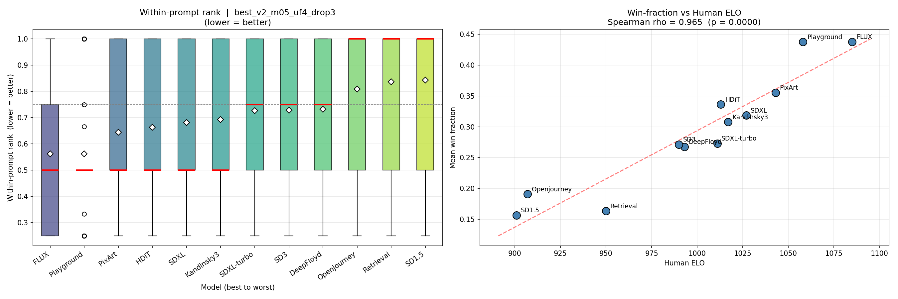
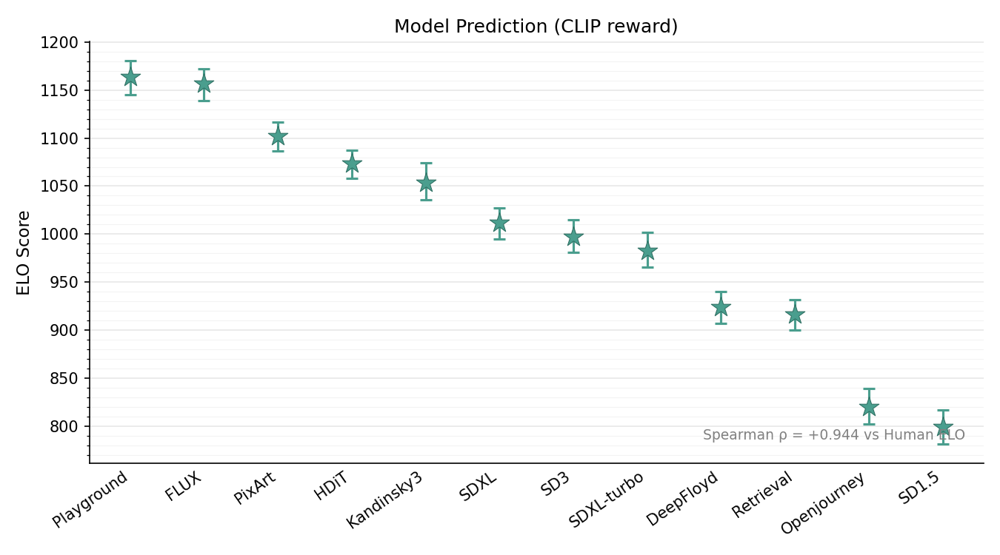

# TaxoGen — ImageReward fine-tuning experiments

Fine-tunes the [ImageReward-v1.0](https://github.com/THUDM/ImageReward) reward model on
pairwise human preferences over 12 image generators, then evaluates whether the resulting
ranking matches human ELO.

## Download images

```bash
hf download Kate-03/TaxoGen_sampled --repo-type=dataset --local-dir data
```

## Setup

Python 3.10 + PyTorch (CUDA 12.8). ImageReward needs small patches to work with
`transformers>=5` (already applied locally; see end of README). Both `transformers==4.30.2`
and `transformers==5.7.0` give numerically identical results.

```bash
python3.10 -m venv benv
source benv/bin/activate
pip install torch torchvision --index-url https://download.pytorch.org/whl/cu128
pip install pandas scikit-learn matplotlib scipy "transformers==4.30.2" image-reward
pip install git+https://github.com/openai/CLIP.git
```

## Training

```bash
bash run_experiments_v2.sh        # margin loss sweep
```

Best config: `--loss margin --margin 0.5 --unfreeze_top_layers 4 --weight_decay 1e-2 --dropout 0.3 --lr 3e-5`
(6 epochs, early stopping patience 3, position-swap augmentation, batch_size 8).

## Best checkpoints

| Checkpoint | Train splits | Best val_acc | Test acc |
|---|---|---|---|
| `ir_loss_runs_v2/best_v2_m05_uf4_drop3.pt` | original | 0.6938 | 0.7343 |
| `ir_loss_runs_v2_reshuffled/best_reshuffled_m05_uf4_drop3.pt` | reshuffled (stratified by `subset`, 75/10/15) | **0.7112** | 0.7216 |
| `ir_loss_runs_v2_tf5/best_tf5_m05_uf4_drop3.pt` | reshuffled, transformers 5.7 | 0.7112 | 0.7216 |

The reshuffled-splits run is the one to trust: original splits had a biased validation set
(baseline ImageReward gets 0.5747 on original val vs 0.6958 on original test — a 12-point
gap that disappears after stratified reshuffle).

## Baseline vs fine-tuned (best_reshuffled_m05_uf4_drop3)

Pairwise binary classification on the held-out test set (351 usable pairs).

| Split | Metric | Baseline IR-v1.0 | Fine-tuned | Δ |
|---|---|---|---|---|
| Val (orig) | binary_acc | 0.5747 | 0.6923 | **+11.8pp** |
| Val (orig) | weighted_f1 | 0.5747 | 0.6923 | +11.8pp |
| Test (orig) | binary_acc | 0.6958 | 0.7352 | +3.9pp |
| Test (orig) | weighted_f1 | 0.6960 | 0.7354 | +3.9pp |
| Val (reshuffled) | binary_acc | 0.6535 | 0.7149 | +6.1pp |
| Val (reshuffled) | weighted_f1 | 0.6535 | 0.7147 | +6.1pp |
| Test (reshuffled) | binary_acc | 0.6496 | **0.7208** | **+7.1pp** |
| Test (reshuffled) | weighted_f1 | 0.6496 | 0.7208 | +7.1pp |
| Test (reshuffled) | f1_B_win | 0.6476 | 0.7216 | +7.4pp |
| Test (reshuffled) | f1_A_win | 0.6516 | 0.7200 | +6.8pp |

Honest improvement over baseline ≈ **+7 percentage points** in both accuracy and weighted F1.

## Within-prompt ranking vs human ELO

Score every test image with the fine-tuned model, rank within each prompt
(`win_frac = 1 − mean within-prompt percentile rank`), then correlate with human ELO.



### Both rankings

| Rank | Human ELO | Model (fine-tuned) |
|---|---|---|
| 1 | FLUX (1085) | FLUX (win_frac=0.438) |
| 2 | Playground (1058) | Playground (0.438) |
| 3 | PixArt (1043) | PixArt (0.355) |
| 4 | SDXL (1027) | HDiT (0.336) |
| 5 | Kandinsky3 (1017) | SDXL (0.318) |
| 6 | HDiT (1013) | Kandinsky3 (0.308) |
| 7 | SDXL-turbo (1011) | SDXL-turbo (0.273) |
| 8 | DeepFloyd (993) | SD3 (0.271) |
| 9 | SD3 (990) | DeepFloyd (0.268) |
| 10 | Retrieval (950) | Openjourney (0.191) |
| 11 | Openjourney (907) | Retrieval (0.163) |
| 12 | SD1.5 (901) | SD1.5 (0.157) |

Disagreements: **HDiT** ranked too high by the model (4 instead of 6), **Retrieval/Openjourney**
swapped at the bottom — both swaps involve models with ELO within 12 points of each other.

### Spearman ρ between rankings

- **Point estimate: ρ = 0.9650** (p < 1e-5)
- Bootstrap (B=2000, clustered by `wordnet_id`):
  - Mean: 0.9258
  - Std: 0.0371
  - 95% CI: [0.839, 0.979]
  - 90% CI: [0.853, 0.972]
  - P(ρ > 0.90) = 81%
  - P(ρ > 0.95) = 30%

The point estimate (0.965) is somewhat optimistic — bootstrap mean is 0.926 and the lower
end of 95% CI is 0.84, which is still a strong rank correlation.

## CLIP fine-tuning experiments (pairs only)

Fine-tunes a CLIP-based reward model (`train_clip_pairs_only.py`) on pairwise pairs only
(Tie and BothBad rows dropped). Reward head: `[img_emb, txt_emb, img*txt, |img-txt|] → Linear(4·d, 1)`.
Preprocessing moved into DataLoader workers for GPU throughput.

### Zero-shot CLIP baseline

Prediction: `A_win if cosine_sim(img_a, text) > cosine_sim(img_b, text)`.

| Model | Test acc | Test wF1 |
|---|---|---|
| clip-vit-base-patch32 | 0.447 | 0.447 |
| clip-vit-large-patch14 | 0.442 | 0.441 |

Zero-shot is **below random** (< 0.50): CLIP cosine similarity does not correlate with
human preferences when both images are generated from the same prompt.

### Fine-tuning sweep results

Settings: freeze backbone, unfreeze top-2 vision + text layers, batch 64, lr 3e-5,
10 epochs (early stopping patience 5), position-swap augmentation.

| Run | Model | Loss | Best val acc | **Test acc** | Test wF1 |
|---|---|---|---|---|---|
| `large14_bt` | large-patch14 | BT | 0.709 | **0.731** | 0.730 |
| `base32_margin_var` | base-patch32 | margin+var | 0.653 | 0.723 | 0.722 |
| `base32_margin` | base-patch32 | margin | 0.661 | 0.718 | 0.717 |
| `base32_bt` | base-patch32 | BT | 0.648 | 0.718 | 0.716 |
| `large14_margin` | large-patch14 | margin | 0.705 | 0.710 | 0.709 |
| `large14_hybrid` | large-patch14 | hybrid | 0.709 | 0.704 | 0.704 |
| `base32_hybrid` | base-patch32 | hybrid | 0.648 | 0.699 | 0.698 |
| `base32_margin_dec` | base-patch32 | margin+dec | 0.655 | 0.697 | 0.695 |
| `base32_infonce` | base-patch32 | InfoNCE | 0.538 | 0.544 | 0.542 |
| `large14_infonce` | large-patch14 | InfoNCE | 0.558 | 0.534 | 0.533 |

**Best checkpoint (loss sweep):** `clip_pairs_ckpt/best_large14_bt.pt`
(clip-vit-large-patch14, BT loss, test acc **0.731**, +28.9 pp over zero-shot).

Key observations:
- Fine-tuning gives a massive **+28 pp** over zero-shot regardless of model/loss.
- `clip-vit-large-patch14` beats `base-patch32` by ~1 pp at best loss.
- `margin_var` (margin + variance regularisation) is the best base32 variant.
- **InfoNCE fails** on both model sizes (~0.54) — in-batch contrastive needs larger
  batch diversity; at 64 samples / 28 batches per epoch there is insufficient negatives.

### Regularisation sweep (large-patch14, BT loss)

Baseline `large14_bt` showed severe overfitting: train acc → 1.000 by epoch 9,
mean_abs_diff exploded 0.57 → 8.43, val acc peaked at epoch 4 then declined.

Settings: same as above but 15 epochs, varying `dropout` and `label_smoothing`.

| Run | dropout | label_smooth | Best val acc | **Test acc** | vs baseline |
|---|---|---|---|---|---|
| `large14_bt` (baseline) | 0.3 | 0.0 | 0.709 | 0.731 | — |
| `large14_bt_drop05` | 0.5 | 0.0 | 0.706 | 0.726 | −0.5 pp |
| `large14_bt_ls01` | 0.3 | 0.1 | 0.705 | 0.689 | −4.2 pp |
| `large14_bt_ls02` | 0.3 | 0.2 | 0.708 | 0.684 | −4.7 pp |
| **`large14_bt_ls01_drop05`** | **0.5** | **0.1** | **0.734** | **0.749** | **+1.8 pp** |

**Best checkpoint (overall):** `clip_pairs_ckpt/best_large14_bt_ls01_drop05.pt`
(test acc **0.749**, +30.7 pp over zero-shot).

Key observations:
- Label smoothing alone **hurts** (−4 pp): softens the loss for correct pairs without
  curbing overconfident wrong predictions, so the model generalises worse.
- Dropout alone helps marginally (−0.5 pp vs baseline, but more stable training).
- **Combined** dropout=0.5 + label_smoothing=0.1 stabilises reward scale
  (mean_abs_diff plateaus at ~2.2 vs runaway 8.4 in baseline) and gives best test acc.

## Label convention bug and corrected CLIP model

### Bug

The pairwise annotation uses the [Chatbot Arena](https://github.com/lm-sys/FastChat) convention:
`result=0` → model\_a wins, `result=1` → model\_b wins.
`arena_elo.py` implements this correctly (`Y[result==0] = 1.0` → model\_a credited).

`train_clip_pairs_only.py` had the **opposite** comment and implementation:
it treated `label=1` as A\_win and `label=0` as B\_win. The model therefore trained to
assign **higher reward to the losing image**, achieving 73% accuracy on the inverted labels
while producing Spearman ρ = −0.96 with human ELO.

Confirmed empirically: all 6 FLUX vs SD1.5 test pairs decoded correctly under the arena
convention (FLUX wins every time), and inverted under the training convention.

### Fix

One-line change in `normalize_label` in `train_clip_pairs_only.py`:

```python
# before (wrong):
return x if x in [0, 1] else None

# after (arena convention):
if x == 0: return 1   # arena 0=A_win  →  loss 1=A_win
if x == 1: return 0   # arena 1=B_win  →  loss 0=B_win
return None
```

### Re-training (clip-vit-large-patch14, BT + dropout=0.5 + label\_smooth=0.1)

Images from `TaxoGen_sampled/` (full train/val/test coverage).
Same hyperparameters as the best regularised run above.

| Split | Pairs | Best val acc | Test acc |
|---|---|---|---|
| train | 1780 | 0.671 (epoch 6) | — |
| test | 351 | — | **0.7226** |

Early stopping at epoch 11 (patience 5).

### Fair correlation with human ELO

Scoring: all 12 models × 577 wordnet IDs from `collected_wordnet_images/`.
Within-prompt rank computed across all 12 models simultaneously (no pair-selection bias).
Bootstrap resamples prompts (wordnet\_ids) with replacement, n=1000.

| Metric | ρ point | 95% CI |
|---|---|---|
| Mean reward | **+0.965** | [+0.937, +0.972] |
| Median reward | **+0.951** | [+0.902, +0.972] |
| Mean rank (1=best) | −0.944 | [−0.965, −0.888] |
| Win@1 fraction | +0.900 | [+0.807, +0.949] |

All CIs are strictly positive (or strictly negative for mean rank). The model strongly and
significantly reproduces the human preference ranking.

### Model ranking

| Human ELO rank | Model | ELO | Model rank | Δ | Median reward | Win@1 |
|---|---|---|---|---|---|---|
| 1 | FLUX | 1085 | 2 | +1 | +0.898 | 0.242 |
| 2 | Playground | 1058 | 1 | −1 | +0.911 | 0.192 |
| 3 | PixArt | 1043 | 3 | 0 | +0.603 | 0.102 |
| 4 | SDXL | 1027 | 6 | +2 | +0.331 | 0.070 |
| 5 | Kandinsky3 | 1017 | 4 | −1 | +0.570 | 0.106 |
| 6 | HDiT | 1013 | 5 | −1 | +0.536 | 0.115 |
| 7 | SDXL-turbo | 1011 | 8 | +1 | +0.217 | 0.050 |
| 8 | DeepFloyd | 993 | 9 | +1 | −0.034 | 0.016 |
| 9 | SD3 | 990 | 7 | −2 | +0.267 | 0.052 |
| 10 | Retrieval | 950 | 10 | 0 | −0.143 | 0.041 |
| 11 | Openjourney | 907 | 11 | 0 | −0.647 | 0.007 |
| 12 | SD1.5 | 901 | 12 | 0 | −0.752 | 0.007 |

Maximum rank error ±2. Bottom 4 models reproduced exactly.
Checkpoint: `clip_fixed_ckpt/best_fixed_labels.pt`

### MLE ELO from model reward (pairwise battles)

ELO computed from all N(N−1)/2 pairwise comparisons within each prompt (winner = higher reward),
using the same Bradley-Terry / logistic regression as `arena_elo.py`.
Bootstrap resamples prompts, n=200. Spearman ρ = **+0.944** vs human ELO.



| Model | Model ELO | 95% CI | Human ELO |
|---|---|---|---|
| Playground | 1163.6 | [1145.5, 1180.7] | 1058 |
| FLUX | 1156.7 | [1139.0, 1172.3] | 1085 |
| PixArt | 1101.7 | [1086.7, 1116.4] | 1043 |
| HDiT | 1073.7 | [1057.9, 1087.6] | 1013 |
| Kandinsky3 | 1053.2 | [1035.4, 1073.9] | 1017 |
| SDXL | 1012.1 | [994.8, 1027.4] | 1027 |
| SD3 | 997.4 | [981.3, 1014.8] | 990 |
| SDXL-turbo | 982.5 | [965.3, 1001.7] | 1011 |
| DeepFloyd | 923.8 | [907.0, 940.0] | 993 |
| Retrieval | 916.1 | [900.2, 931.5] | 950 |
| Openjourney | 820.0 | [802.0, 838.9] | 907 |
| SD1.5 | 799.3 | [781.1, 816.8] | 901 |

### Per-subset best model (scores_collected.csv)

Scored with `score_collected.py` using checkpoint `best_fixed_labels.pt`
(clip-vit-large-patch14, BT loss, dropout=0.5, label_smoothing=0.1, **trained with definitions** —
prompt format: `"An image of {core_synset} ({definition})"`).

#### Global ranking by mean reward

| Rank | Model | Mean reward | Median reward |
|---|---|---|---|
| 1 | Playground | 0.880 | 0.949 |
| 2 | FLUX | 0.842 | 0.825 |
| 3 | HunyuanDiT | 0.637 | 0.676 |
| 4 | Kandinsky3 | 0.624 | 0.710 |
| 5 | PixArt | 0.481 | 0.453 |
| 6 | SDXL | 0.254 | 0.311 |
| 7 | SDXL-turbo | 0.086 | 0.051 |
| 8 | DeepFloyd | 0.063 | 0.066 |
| 9 | SD3 | 0.062 | 0.184 |
| 10 | Retrieval | −0.174 | −0.173 |
| 11 | Openjourney | −0.708 | −0.883 |
| 12 | SD 1.5 | −0.754 | −0.807 |

#### Best model per subset (mean reward on test wordnet_ids)

Scored from `collected_wordnet_images/` (6905 rows, 577 wids × 12 models, 19 retrieval pairs missing).
Bootstrap CIs over wordnet_ids (B=2000, resample prompts with replacement).
Win rate = fraction of bootstrap samples where the listed model ranks first.

| Subset | n wids | Best model | Mean | 95% CI | Win rate | Runner-up | Runner-up 95% CI |
|---|---|---|---|---|---|---|---|
| `appendix` | 85 | FLUX | 0.931 | [0.706, 1.139] | 38% | Playground | [0.683, 1.123] |
| `appendix_llama` | 85 | **FLUX** | 1.141 | [0.890, 1.390] | **96%** | Kandinsky3 | [0.615, 1.122] |
| `leafs_and_no_leafs` | 34 | FLUX | 0.961 | [0.597, 1.308] | 67% | Playground | [0.571, 1.151] |
| `leafs_and_no_leafs_llama` | 36 | FLUX | 0.730 | [0.458, 1.001] | 59% | Playground | [0.342, 1.006] |
| `predict_hypernym` | 142 | **Playground** | 0.949 | [0.774, 1.112] | **98%** | FLUX | [0.602, 0.925] |
| `predict_hypernym_llama` | 139 | **Playground** | 0.851 | [0.694, 1.009] | **85%** | FLUX | [0.606, 0.879] |
| `simple_triplet_2parent` | 27 | Playground | 0.762 | [0.347, 1.129] | 74% | FLUX | [0.228, 1.017] |
| `simple_triplet_2parent_llama` | 29 | FLUX | 0.832 | [0.444, 1.218] | 75% | Playground | [0.356, 1.027] |

FLUX and Playground split 4 subsets each. Statistically robust (win rate ≥ 85%):
`appendix_llama` (FLUX, 96%), `predict_hypernym` (Playground, 98%),
`predict_hypernym_llama` (Playground, 85%). The remaining 5 subsets have overlapping CIs
— fewer wids (27–85) make the winner uncertain.

### Without-definition model (clip-vit-large-patch14, BT loss)

Same hyperparameters as `best_fixed_labels` but prompt = `"An image of {core_synset}"`
(no definition). Flag: `--no_definition`. Checkpoint: `clip_nodef_ckpt/best_nodef_large14_bt.pt`.

| | With definition | Without definition |
|---|---|---|
| Best val acc | 67.14% | 66.75% |
| **Test acc** | 72.26% | **72.51%** |
| Test wF1 | 0.722 | 0.723 |
| Early stopping epoch | 6 | 6 |

Without definition is marginally better on test (+0.25 pp). Training dynamics differ:
train acc reaches 99%+ by epoch 5 (faster memorisation without the definition anchor),
but val continues to improve slowly through epoch 11.

#### Global ranking by mean reward (without definition)

| Rank | Model | Mean reward | Median reward |
|---|---|---|---|
| 1 | Playground | 0.952 | 1.014 |
| 2 | FLUX | 0.938 | 0.927 |
| 3 | PixArt | 0.715 | 0.708 |
| 4 | HunyuanDiT | 0.612 | 0.657 |
| 5 | Kandinsky3 | 0.579 | 0.632 |
| 6 | SDXL | 0.403 | 0.434 |
| 7 | SDXL-turbo | 0.313 | 0.367 |
| 8 | SD3 | 0.244 | 0.326 |
| 9 | DeepFloyd | 0.027 | 0.081 |
| 10 | Retrieval | −0.040 | −0.013 |
| 11 | Openjourney | −0.462 | −0.510 |
| 12 | SD 1.5 | −0.521 | −0.571 |

#### Best model per subset (without definition, B=2000 bootstrap)

| Subset | n wids | Best model | Mean | 95% CI | Win rate | Runner-up | Runner-up 95% CI |
|---|---|---|---|---|---|---|---|
| `appendix` | 85 | FLUX | 1.087 | [0.868, 1.298] | 49% | Playground | [0.817, 1.242] |
| `appendix_llama` | 85 | **FLUX** | 1.253 | [1.008, 1.492] | **97%** | Kandinsky3 | [0.726, 1.248] |
| `leafs_and_no_leafs` | 34 | FLUX | 1.049 | [0.656, 1.407] | 65% | Playground | [0.662, 1.250] |
| `leafs_and_no_leafs_llama` | 36 | Playground | 0.758 | [0.421, 1.092] | 56% | FLUX | [0.429, 1.031] |
| `predict_hypernym` | 142 | **Playground** | 1.061 | [0.885, 1.220] | **96%** | FLUX | [0.735, 1.056] |
| `predict_hypernym_llama` | 139 | **Playground** | 0.868 | [0.715, 1.024] | **80%** | FLUX | [0.634, 0.907] |
| `simple_triplet_2parent` | 27 | **Playground** | 1.070 | [0.673, 1.429] | **92%** | FLUX | [0.348, 1.164] |
| `simple_triplet_2parent_llama` | 29 | FLUX | 0.857 | [0.453, 1.268] | 72% | Playground | [0.447, 1.034] |

#### Comparison: with vs without definition

| Subset | With def (best / win rate) | Without def (best / win rate) |
|---|---|---|
| `appendix` | FLUX / 38% | FLUX / 49% |
| `appendix_llama` | FLUX / 96% | FLUX / **97%** |
| `leafs_and_no_leafs` | FLUX / 67% | FLUX / 65% |
| `leafs_and_no_leafs_llama` | FLUX / 59% | Playground / 56% |
| `predict_hypernym` | Playground / **98%** | Playground / 96% |
| `predict_hypernym_llama` | Playground / 85% | Playground / **80%** |
| `simple_triplet_2parent` | Playground / 74% | Playground / **92%** |
| `simple_triplet_2parent_llama` | FLUX / 75% | FLUX / 72% |

Both models agree on the winner in 7/8 subsets. Only `leafs_and_no_leafs_llama` flips
(FLUX→Playground, both ~55-59%). Without-definition model is more decisive on
`simple_triplet_2parent` (92% vs 74%).

### LoRA fine-tuning sweep (base-patch32 & large-patch14, BT loss)

Instead of unfreezing top layers, LoRA adapters are injected into `q_proj` and `v_proj`
of all attention layers via `peft`. Base weights are fully frozen; only LoRA params +
`visual_projection` + `text_projection` + reward head are trained.

**Setup:** `train_clip_pairs_only.py --use_lora`, splits in `splits/`, images in `../TaxoGen_sampled/`.

#### Hyperparameter search (base-patch32, BT loss)

| Run | lora_r | lora_alpha | lora_dropout | weight_decay | lr | label_smooth | early_stop | best val acc | **test acc** |
|---|---|---|---|---|---|---|---|---|---|
| v1 | 8 | 16 | 0.05 | 0.01 | 3e-5 | 0.0 | 5 | 0.679 | — |
| v2 | 8 | 16 | 0.15 | 0.05 | 3e-5 | 0.0 | 5 | 0.683 | — |
| **v3** | **8** | **16** | **0.15** | **0.05** | **1e-5** | **0.1** | **3** | **0.688** | **0.7125** |
| r16 | 16 | 32 | 0.15 | 0.05 | 1e-5 | 0.1 | 3 | 0.696 | 0.7068 |

Trainable params: v1–v3 = **1,153,025** / 151,774,978 (0.76%); r16 = **1,644,545** (1.08%).

#### Model size comparison (best hyperparams from v3)

| Model | lora_r | Trainable | best val acc | **test acc** |
|---|---|---|---|---|
| **base-patch32 (v3)** | **8** | **1.15 M** | **0.688** | **0.7125** |
| base-patch32 | 16 | 1.64 M | 0.696 | 0.7068 |
| large-patch14 | 8 | 2.47 M | 0.696 | 0.7066 |

**Best LoRA checkpoint:** `clip_pairs_only_ckpt/best_clip_bt_lora_v3.pt`
(base-patch32, r=8, test acc **71.25%**).

Key observations:
- `lr=3e-5` causes rapid overfitting (train/val split +15 pp by epoch 4–5); dropping to
  `lr=1e-5` with cosine warmup lets the model converge smoothly over 7 epochs.
- Label smoothing alone at `lr=3e-5` did not help (same overfitting pattern); combined
  with slow lr it stabilises training noticeably.
- `r=16` achieves higher val acc (0.696 vs 0.688) but generalises slightly worse on test —
  the extra capacity memorises val-specific patterns.
- `large-patch14` follows the same pattern: needs more epochs to warm up (peak at epoch 9
  vs epoch 4 for base), achieves similar val acc but does not beat base on test.
- All LoRA runs early-stopped at epoch 7 (patience 3), consistent across configurations.

#### LoRA vs freeze/unfreeze (best of each approach)

| Approach | Model | test acc |
|---|---|---|
| Freeze + unfreeze top 2 layers | large-patch14, BT | 0.731 |
| Freeze + unfreeze + dropout=0.5 + ls=0.1 | large-patch14, BT | **0.749** |
| **LoRA r=8** | **base-patch32, BT** | **0.7125** |
| LoRA r=8 | large-patch14, BT | 0.7066 |

LoRA (0.76% of params) falls ~3-4 pp behind the best freeze/unfreeze run, but trains
faster, uses less memory, and requires no manual layer-count tuning.

## Notes on training dynamics

The pure margin loss (`ReLU(margin − signed_diff)`) does not show a continuously
decreasing val loss the way a Bradley-Terry / cross-entropy loss would. Once a pair is
correctly ranked with a wide enough margin, it contributes 0 to the gradient, while
incorrectly ranked pairs keep contributing more as the model spreads its reward scale
(`reward_std` grows from ~0.4 → 1.0+ across epochs). Net effect: val accuracy crawls up
slowly while val loss can plateau or rise — this is by design of margin loss, not a bug.
The `bt` and `hybrid` losses in `run_experiments.sh` (v1) show a more conventional
"loss decreases as accuracy increases" pattern.

## ImageReward patches (for `transformers>=5`)

Required when running on transformers 5+. All patches are local edits to the installed
`ImageReward` package:

- `ImageReward/__init__.py` — wrap `from .ReFL import *` in `try/except` (ReFL pulls in
  recent `diffusers` which clashes with older transformers).
- `ImageReward/models/BLIP/med.py`:
  - `ModelOutput` import: fall back to `transformers.utils` if `transformers.file_utils`
    is missing.
  - Pull `apply_chunking_to_forward`, `prune_linear_layer` from `transformers.pytorch_utils`.
  - `find_pruneable_heads_and_indices` was removed in v5 → inlined the original
    implementation.
  - Added class attribute `all_tied_weights_keys = {}` to `BertPreTrainedModel`
    (transformers 5 expects it on every `PreTrainedModel`).
  - Re-implemented `get_head_mask` and `_convert_head_mask_to_5d` (also removed in v5).
- `ImageReward/models/BLIP/blip.py` — replace `tokenizer.additional_special_tokens_ids[0]`
  (attribute removed in v5) with `tokenizer.convert_tokens_to_ids('[ENC]')`.
